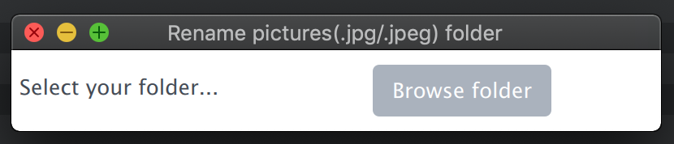
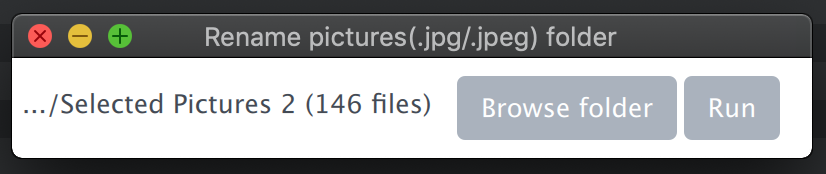
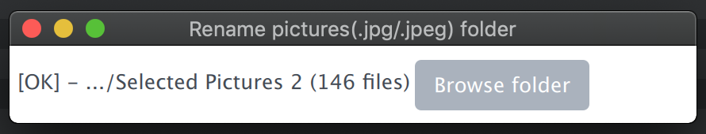

# manage-pictures
A simple program written in Golang that allows you to rename all pictures (.jpg/.jpeg) using the EXIF data (datetime,placename (API OpenStreetSource), gps position) if available.

## Usage
```
# Install package
go get -u github.com/xor-gate/goexif2/exif
go get -u github.com/xor-gate/goexif2/tiff

# Build program
go build rename-pictures.go

# Run program
./rename-pictures <directory_path>
```

## Output
`yyyy_mm_yy_hhmmName-City-CountryCode&<lat>&<long>.jpg`   
`2016_06_03_1543ObservatoryHouse-CityofEdinburgh-gb&55.954697&-3.184333.jpg`

## GUI - Desktop

- RenamePictures on MacOS &rarr; [Download](https://vomnes.github.io/download/rename-pictures-macos.zip)






